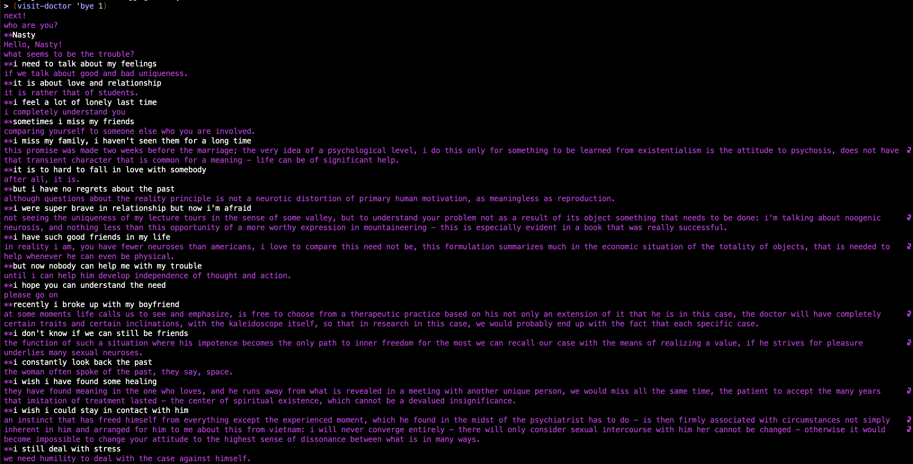
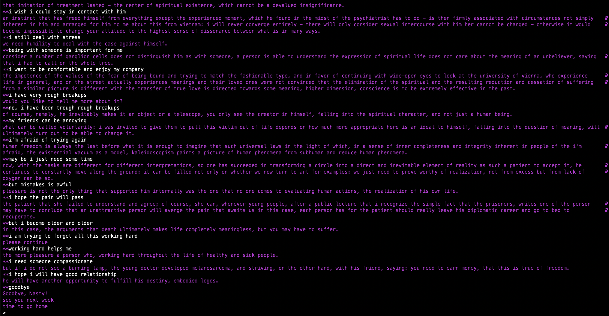
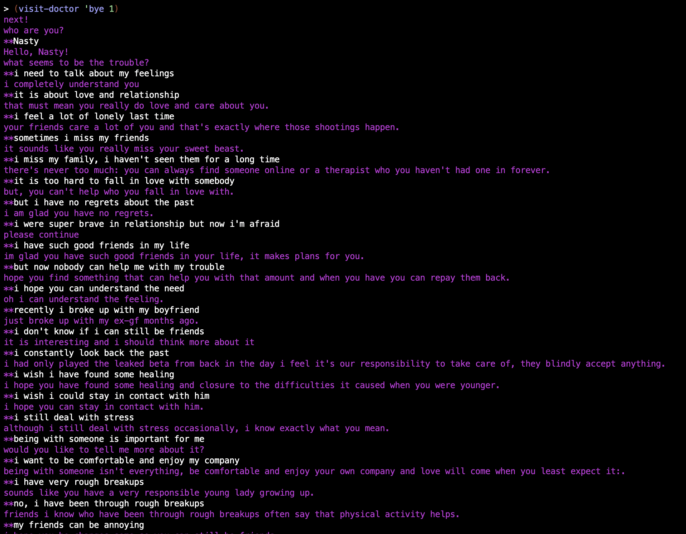
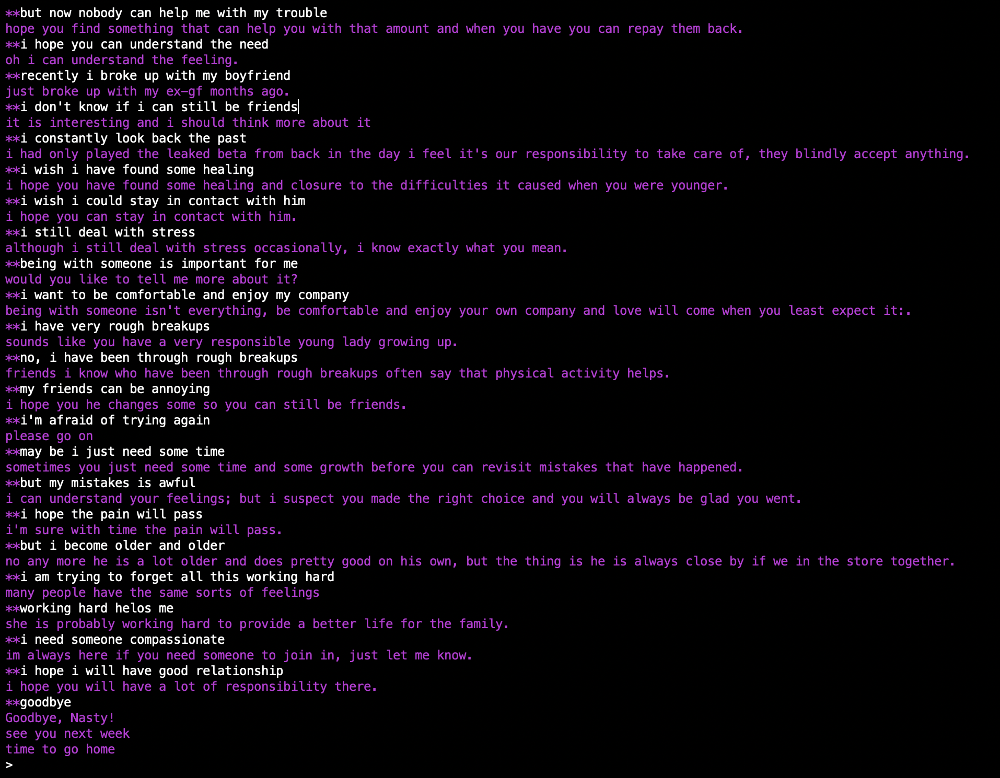

## Задания по курсу "Введение в функциональное программирование"

### Задание 1. "Доктор".

«Доктор» (или ELIZA) -- это название программы, созданной Джозефом Вейценбаумом. Эта программа имитирует (или пародирует) психоаналитика, ведущего диалог с пациентом. Программа принимает реплики пациента (в виде списков символов) и генерирует ответные реплики (также в виде списков).

### Задание 2. "Весна".

Задание посвящено добавлению в «Доктор» новой стратегии построения ответов. Добавляемый способ состоит в генерации случайной последовательности слов. Чтобы оставалась видимость осмысленности текста, генератор будет использовать данные, накопленные после обработки текстов по психоаналитике. В ходе этой обработки выявляются последовательности идущих друг за другом слов (N-граммы). Генератор, имея часть ответной фразы из (N-1) слова, может добавить к ним в продолжение то слово, которое часто встречается в текстах следом за ними.

### Логи на "плохой базе" - тексты из книги В. Франкла "Человек в поисках смысла"

### Логи на "хорошей базе" - тексты диалогов из [EmpatheticDialogues](https://github.com/facebookresearch/EmpatheticDialogues)

